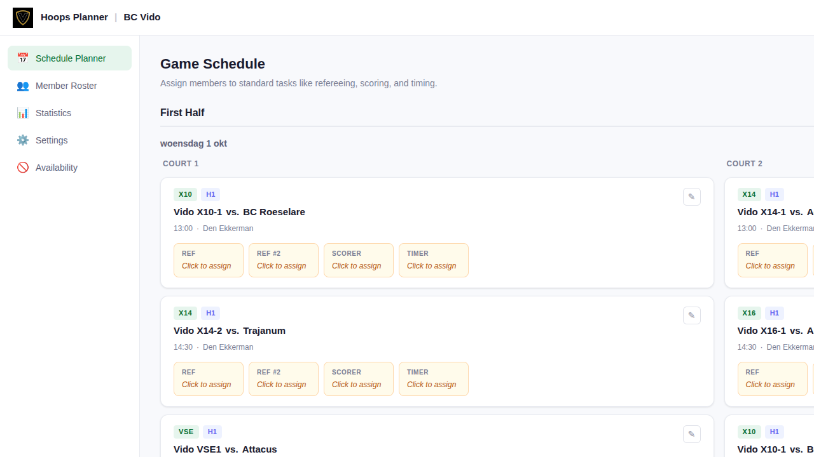
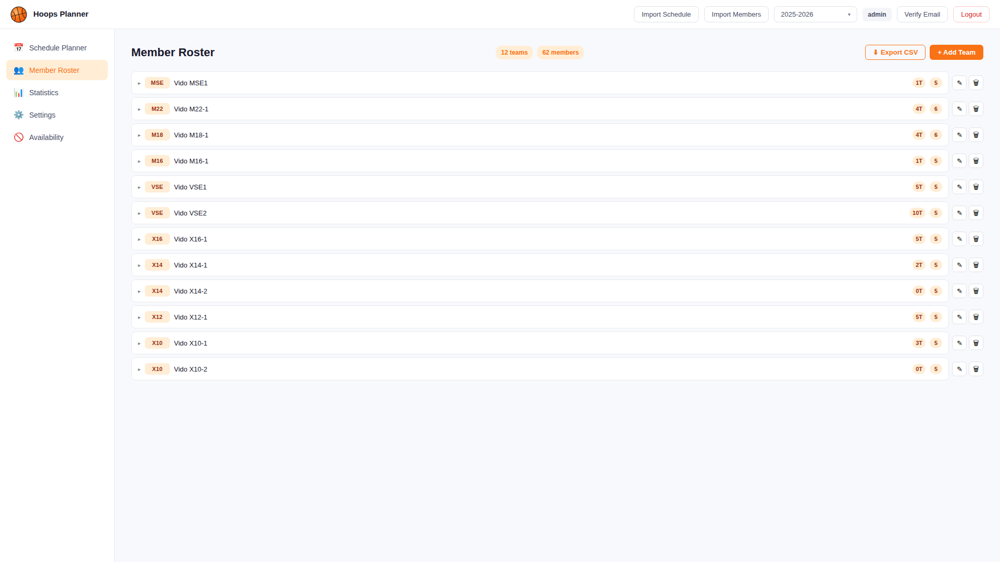
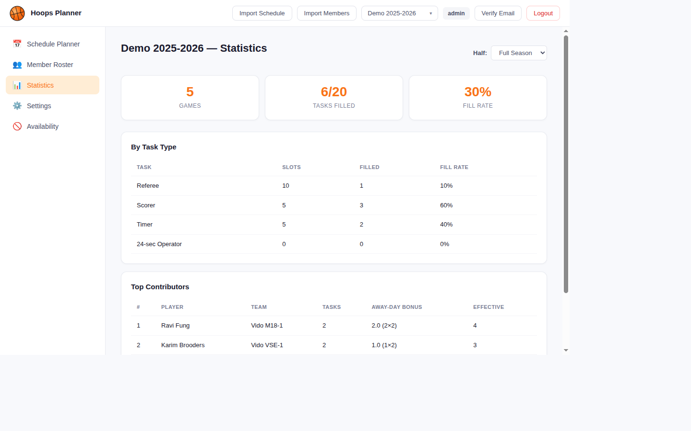

# Hoops Planner 🏀

[](https://polyformproject.org/licenses/noncommercial/1.0.0)
[](https://www.python.org/downloads/release/python-3130/)
[](https://github.com/astral-sh/uv)
[](https://github.com/coenvdgrinten/hoops-planner/actions/workflows/lint.yml)
[](https://github.com/coenvdgrinten/hoops-planner/actions/workflows/typecheck.yml)
[](https://github.com/coenvdgrinten/hoops-planner/actions/workflows/test.yml)
[](https://github.com/coenvdgrinten/hoops-planner/actions/workflows/e2e.yml)

A task planning application for basketball clubs. Assign referees, scorers, timers, and 24-second operators to games while automatically enforcing eligibility rules and distributing tasks fairly across your roster.

> **Built for BC Vido** — a basketball club in Veldhoven, The Netherlands — but designed to work for any club.

---

## Screenshots

### Schedule Planner



### Member Roster



### Statistics



---

## Table of Contents

- [Hoops Planner 🏀](#hoops-planner-)
  - [Screenshots](#screenshots)
    - [Schedule Planner](#schedule-planner)
    - [Member Roster](#member-roster)
    - [Statistics](#statistics)
  - [Table of Contents](#table-of-contents)
  - [Features](#features)
  - [Tech Stack](#tech-stack)
  - [Quick Start](#quick-start)
  - [Demo Data](#demo-data)
  - [Development](#development)
    - [Backend](#backend)
    - [Frontend](#frontend)
  - [Configuration](#configuration)
  - [Project Structure](#project-structure)
  - [Task Types](#task-types)
  - [Eligibility Rules](#eligibility-rules)
  - [License](#license)

---

## Features

- **📅 Interactive Planner** — visual game schedule with click-to-assign task cards and smart candidate suggestions
- **📥 CSV Import** — upload season schedules and member lists in one click
- **🔒 Eligibility Rules** — automatic conflict detection (team games, age category, certification level)
- **⚖️ Fair Distribution** — task counter with multipliers rewards members already at the gym
- **📊 Statistics** — per-player and per-team task tracking with fill-rate analytics
- **👥 Member Roster** — manage teams, players, coaches, and certifications
- **📱 Member View** — mobile-friendly read-only view for checking upcoming duties
- **📄 PDF & CSV Export** — print-ready schedule output and spreadsheet export
- **📅 Calendar Export** — `.ics` download for individual games or full season
- **🔐 Auth** — registration, password reset, and email verification

## Tech Stack

| Layer      | Stack                                              |
| ---------- | -------------------------------------------------- |
| Frontend   | React 19 + TypeScript + Vite + TanStack Query      |
| Backend    | Django + DRF (Python 3.13)                         |
| Database   | SQLite (dev)                                       |
| Testing    | pytest (backend), Playwright (e2e)                 |
| Linting    | Ruff (Python), ESLint (frontend)                   |
| Type Check | ty (Python), tsc (frontend)                        |
| PDF        | WeasyPrint                                         |
| Packaging  | uv (Python), pnpm (frontend)                       |

---

## Quick Start

```bash
# Clone and enter the repo
git clone https://github.com/coenvdgrinten/hoops-planner.git
cd hoops-planner

# Start the containers
docker compose up --build
```

- Frontend: <http://localhost:5173>
- Backend API: <http://localhost:8000/api/>

---

## Demo Data

Populate the database with a ready-to-explore club — 12 teams across mixed age
categories, a roster of players/coaches/referees, one season of scheduled games,
and a handful of pre-filled task assignments — so you can log in and click around
without importing CSVs by hand.

```bash
# Wipe existing club data and seed fresh demo data (default)
./seed
```

Log in at <http://localhost:5173> — each account's password equals its username:

| Username  | Password  |
| --------- | --------- |
| `planner` | `planner` |
| `coach`   | `coach`   |
| `admin`   | `admin`   |

By default `./seed` wipes all games, tasks, assignments, players, and teams (plus
any non-demo seasons) before seeding, so you always get a clean, known state. Pass
`--no-flush` to keep existing data and only upsert the demo users/teams/players:

```bash
./seed --no-flush
```

You can also run the underlying management command directly:

```bash
docker compose exec backend uv run manage.py seed_demo        # wipe + seed
uv run python manage.py seed_demo --no-flush                  # merge (local SQLite)
```

> **E2E:** the Playwright suite seeds automatically via a global-setup fixture
> (`frontend/e2e/global-setup.ts`) before tests run, so no manual step is needed.

---

## Development

### Backend

```bash
# Install dependencies
uv sync

# Run migrations
uv run python manage.py migrate

# Start dev server
uv run python manage.py runserver

# Run tests
PYTHONPATH=src uv run pytest

# Lint and type-check
uv run ruff check src tests
uv run ty check src tests
```

### Frontend

```bash
cd frontend

# Install dependencies
pnpm install

# Start dev server (points to backend container)
pnpm dev

# Type-check, lint, and build
pnpm check
pnpm lint
pnpm build

# Run e2e tests
pnpm test:e2e
```

---

## Configuration

Set via environment variables (or `.env`):

| Variable               | Default                                  | Description                                  |
| ---------------------- | ---------------------------------------- | -------------------------------------------- |
| `DEBUG`                | `False`                                  | Django debug mode                            |
| `SECRET_KEY`           | *(required)*                             | Django secret key                            |
| `DB_PATH`              | `/data/db.sqlite3`                       | SQLite database path                         |
| `SITE_URL`             | `http://localhost:5173`                  | Base URL for email links                     |
| `EMAIL_BACKEND`        | `django.core.mail.backends.console`      | Email backend for dev/prod                   |
| `DEFAULT_FROM_EMAIL`   | `noreply@example.com`                    | Sender address for outgoing emails           |
| `VITE_API_URL`         | `http://backend:8000`                    | Frontend → backend API URL                   |

---

## Project Structure

```text
├── docker-compose.yml
├── Dockerfile
├── manage.py
├── pyproject.toml
├── seed
├── frontend/
│   ├── src/
│   │   ├── api.ts
│   │   ├── App.tsx
│   │   └── components/
│   └── e2e/
├── src/
│   └── hoops_planner/
│       ├── settings.py
│       ├── urls.py
│       └── core/
│           ├── models.py
│           ├── views.py
│           ├── serializers.py
│           ├── auth_views.py
│           ├── eligibility.py
│           ├── suggestions.py
│           ├── statistics.py
│           ├── importers.py
│           ├── demo_seed.py
│           ├── pdf_export.py
│           ├── management/
│           │   └── commands/
│           │       └── seed_demo.py
│           └── migrations/
└── tests/
```

---

## Task Types

| Task                | Description                                    |
| ------------------- | ---------------------------------------------- |
| **Referee**         | 1–2 per game, configurable per age category    |
| **Scorer**          | Live scorekeeping on a tablet                  |
| **Timer**           | Physical scoreboard operator                   |
| **24s Operator**    | 24-second clock (configurable per team)        |

---

## Eligibility Rules

A member is ineligible if:

- Their own team has a home game at the same time
- Their own team has an away game on the same day
- For refereeing: their team is younger than the game's teams
- For refereeing: they lack the required certification level
- They're already assigned to a task in that game

Coaches are exempt from mandatory tasks but can still volunteer.

---

## License

[PolyForm Noncommercial 1.0.0](LICENSE) — free for non-commercial use.
